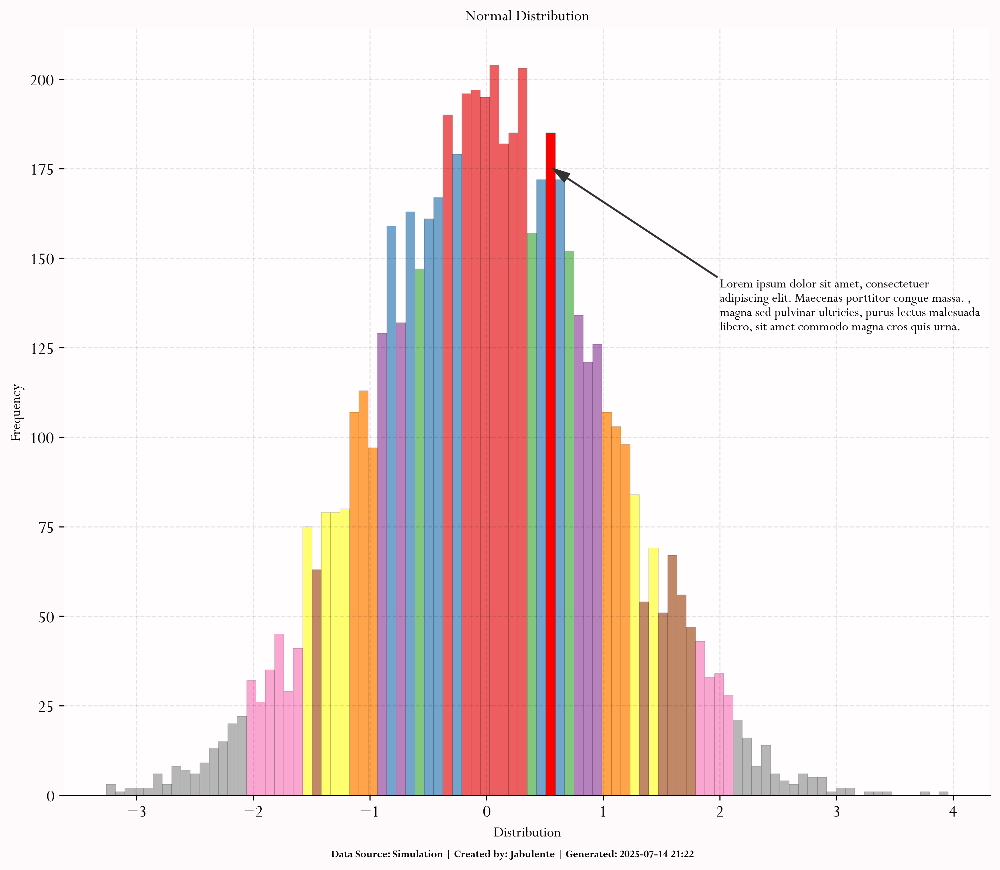
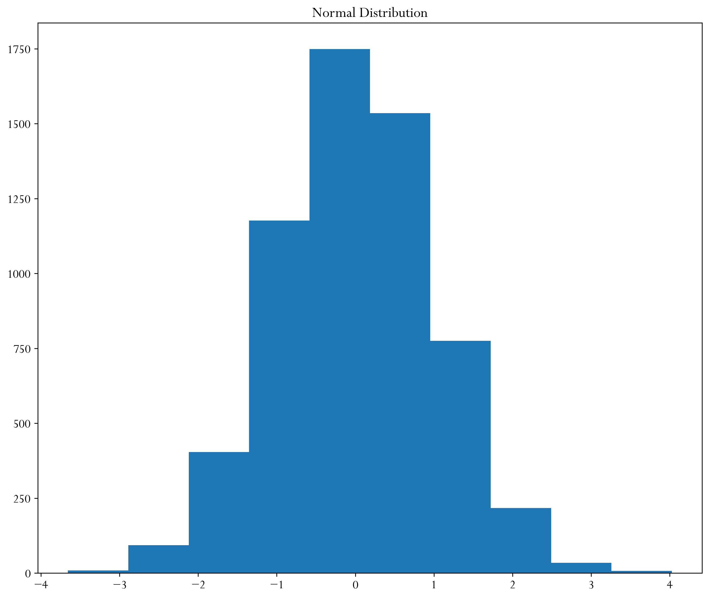
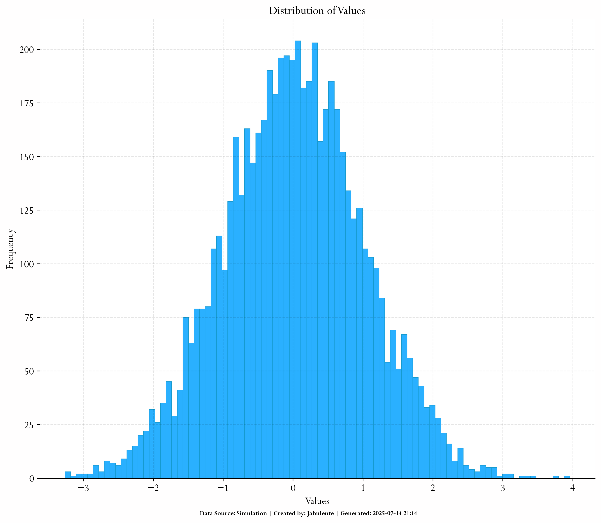
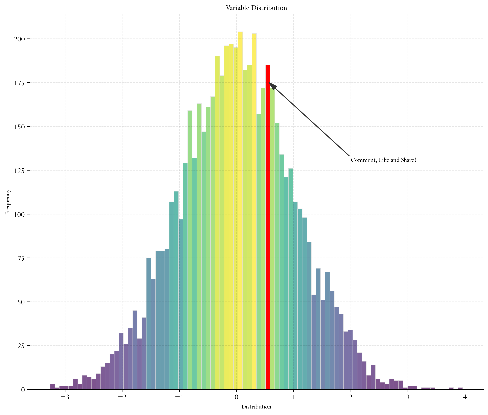
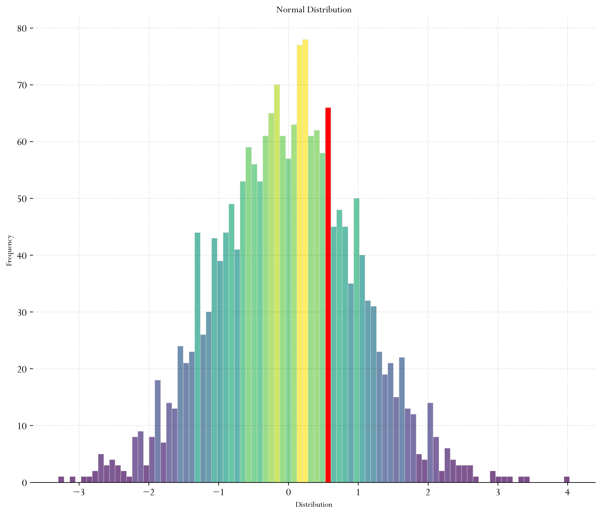
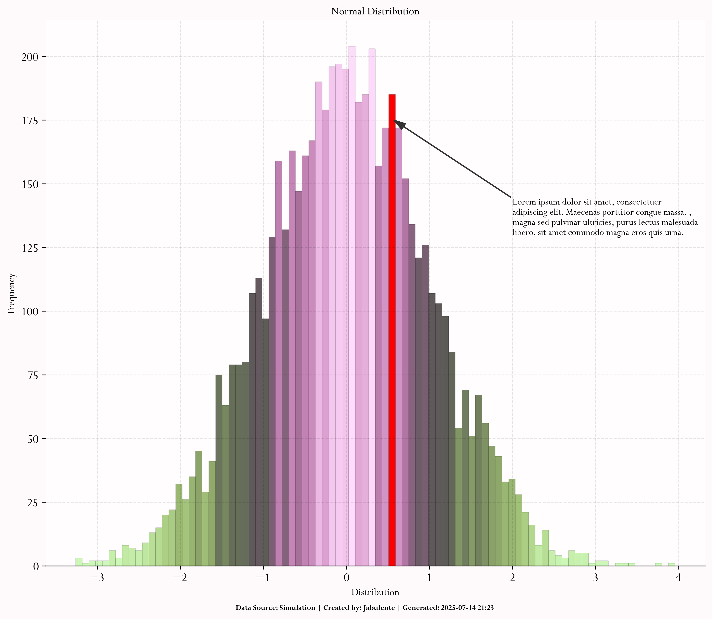

<h1 align = 'center'>Histogram Visualization With Matplotlib</h1>

 

This repository showcases how to create visually appealing and customized histograms using Python’s Matplotlib and Seaborn libraries. It includes examples of enhancing default plots with colors, fonts, transparency, and layout adjustments to better communicate data distribution insights.

## Features
- Custom color palettes and transparency
- Font and layout adjustments for presentation-ready plots
- Fine-tuned bin settings for detailed distribution insights
- Minimal and clean design aesthetics

##  Technologies Used
- Python 3
- Matplotlib
- Seaborn
- Jupyter Notebook

## 🖼 Sample Outputs

Below are examples of customized histograms from the project:

---

---

---

---

----

---

> *Images are included in the `Outputs/` folder.*

##  How to Use
Clone the repo and run the Jupyter Notebook to explore how each customization enhances the histogram plot.

# Contribute & Support

If you find this project useful or inspiring:

-  Star the repository
-  Leave a comment or suggestion
-  Share with others

----

